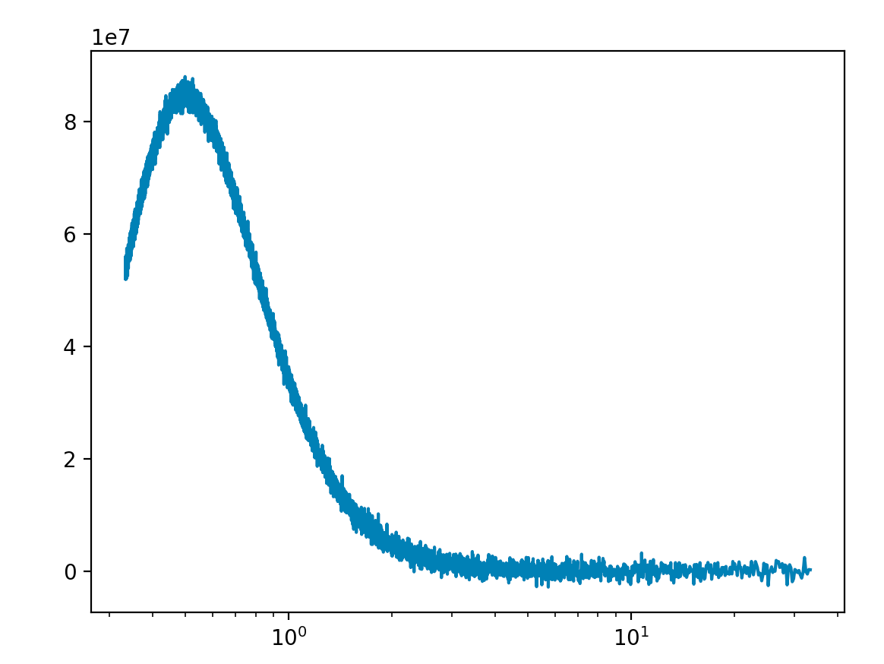
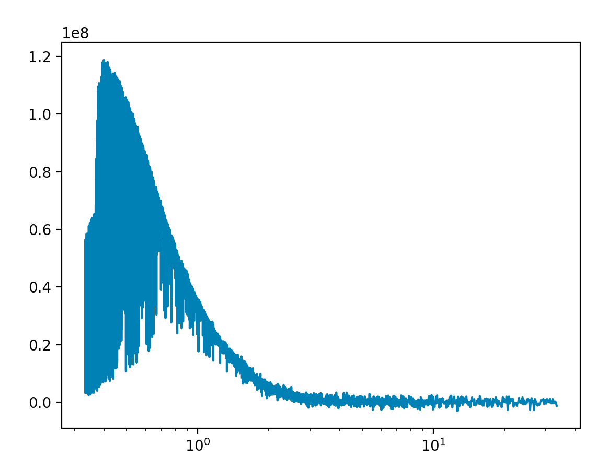
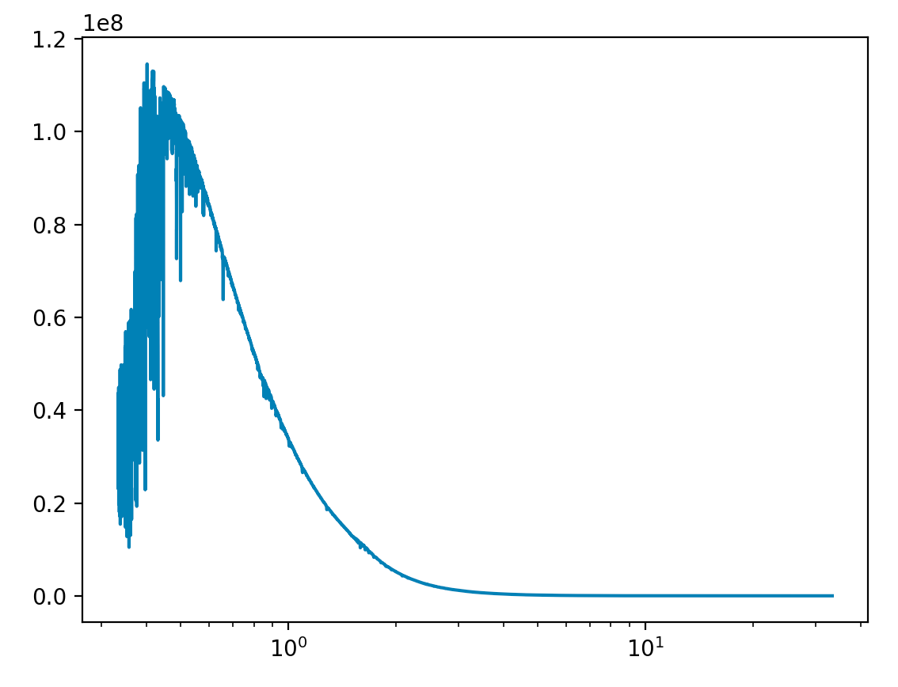

.. _mixinsdevel:

======
Mixins
======

.. versionadded:: 3.1

Mixins are lighter components with the sole purpose of giving 
*all* atmospheric components new abilities and features. For the coding
inclined you can see the article `here <wiki_>`_.

Motivation
----------

To understand this, lets take an viable scenario. Imagine you've come up with
an amazing idea. What if all temperature profiles must be doubled to
be physically valid? Incredible! So you begin your Nobel Prize winning
work and begin defining new temperature profiles for each of the
available ones in TauREx3. You create ``isothermal_double``,
``npoint_double``, ``guillot_double`` etc and release it to the amazement of
the public. Someone comes along and develops a super new temperature profile,
lets call it ``supernewtemp``. Well now looks like you'll now have to go back
and implement a ``supernewtemp_double`` but no matter, progress comes with
sacrifice. Now your colleague suggests that adding 50K also improves the profile,
so they implement ``isothermal_50``, ``npoint_50``, ``guillot_50`` and ``supernewtemp_50``. 
Now some people say they want to double it and add 50 so someone must create
``isothermal_double_50``, ``npoint_double_50``, ``guillot_double_50`` and ``supernewtemp_double_50``
and other people want to add 50 and double so now we need to build
``isothermal_50_double``, ``npoint_50_double``, ``guillot_50_double`` and ``supernewtemp_50_double``
and oh no someone just created a brand new temperature profile and deeper into the
endless abyss you go.

This is what mixins solve, if instead we develop a ``doubler`` mixin we can instead
*add* it to our original profile using the ``+`` operator::

    [Temperature]
    profile_type = doubler+isothermal
    T = 1000

And TauREx will build an isothermal profile that doubles itself for you. Neat
We can do the same and build an ``add50`` mixin::

    [Temperature]
    profile_type = add50+isothermal

Now the beauty is that we can stack them together!! If we want to double then add 50
we can write::

    [Temperature]
    profile_type = add50+doubler+isothermal

Or add 50 then double::

    [Temperature]
    profile_type = doubler+add50+isothermal

The examples given are fairly simple, performing a summation. There are other
useful features related to mixins, one mixin sets planet and stellar properties
by name! Another splices UV data into stellar models.

Developing Mixins
-----------------

Each TauREx component has a mixin equivalent, developing mixins means
choosing what mixin type to inherit from. (i.e :class:`~taurex.data.stellar.Star` has :class:`~taurex.mixin.core.StarMixin`).
Developing mixins work slightly differently to traditional 
components. 
Lets develop two mixins for the stellar models. One that adds noise and another
the removes noise (redundant but shows the nature of them) to the spectral emission density.
First, unless you know what you are doing, **do not create an __init__ method**.
There is a dedicated initialization method we can use, ``__init_mixin__``. Lets setup our
mixins:

.. code-block:: python

    from taurex.mixin import StarMixin
    import numpy as np
    from scipy.signal import medfilt

    class Noiser(StarMixin):

        def __init_mixin__(self, noise_level=1.0):
            self.noise_level = noise_level

        @classmethod
        def input_keywords(cls):
            return ['noiser', ]

    class Denoiser(StarMixin):

        def __init_mixin__(self, kernel_size=3):
            self.kernel_size = kernel_size

        @classmethod
        def input_keywords(cls):
            return ['denoiser', ]

Now ``Noiser`` will use ``numpy.random.randn`` to generate gaussian noise and
add it to the spectral emission density. And ``Denoiser`` will use
a median filter from ``scipy.signal.medfilt`` to clean up the spectral emission
density.

Since its the spectral emission density we are modify we would need to run and then overwrite
the original classes function. We can accomplish this by defining our own :meth:`~taurex.data.stellar.Star.spectralEmissionDensity`
and exploiting `super() <super_>`_:

.. code-block:: python

    class Noiser(StarMixin):

        ...

        @property
        def spectralEmissionDensity(self):
            previous_sed = super().spectralEmissionDensity

            new_sed = previous_sed + \
                    np.random.randn(*previous_sed.shape)*self.noise_level
            
            return new_sed
    

    class Denoiser(StarMixin):

        ...

        @property
        def spectralEmissionDensity(self):
            previous_sed = super().spectralEmissionDensity

            new_sed = medfilt(previous_sed, kernel_size=self.kernel_size)

            return new_sed

`super() <super_>`_ is key to mixins. It allows use to evaluate the method of the super class, or in other words. 
*The class that came before us*. Using this, we can get the original spectrum and then modify it and return it.
It can also be chained as well. If we apply two mixins that modify this, then calling super will evaluate the previous mixin which,
evaluates the original class. Nicely, this tangent leads us to the next point, how do we actually use the mixin?
The :func:`~taurex.mixin.core.enhance_class` function does exactly this! It takes our *base*, a list of mixins
and arguments and generates a new instance of the class! Lets try it for the noiser and modify the black body star::

    >>> from taurex.mixin import enhance_class
    >>> from taurex.stellar import BlackbodyStar
    >>> new_star = enhance_class(BlackbodyStar, [Noiser, ], temperature=5800,
                                                            radius=1.0,
                                                            noise_level=1e6)
    >>> new_star
    <taurex.mixin.core.Noiser+BlackbodyS at 0x7fdb93de4c70>

The class is neither a Noiser or Blackbody but a combination of both. What you might notice is
arguments from both :class:`~taurex.data.stellar.star.BlackbodyStar` and ``Noiser`` passed in.
Each argument is automatically passed to the correct class for you! Anyway lets plot it and see::
    
    >>> import matplotlib.pyplot as plt
    >>> wngrid = np.linspace(300,30000,10000)
    >>> new_star.initialize(wngrid)
    >>> plt.figure()
    >>> plt.plot(10000/wngrid,new_star.spectralEmissionDensity)
    >>> plt.xscale('log')
    >>> plt.show()

    Blackbody spectrum with ``Noiser``

Nice! Now whats makes them special is that we can apply it to the Phoenix model
with no additional effort::

    >>> from taurex.stellar import PhoenixStar
    >>> new_star = enhance_class(PhoenixStar, [Noiser, ], temperature=5800, radius=1.0, 
                                 phoenix_path='/path/to/phoenix', noise_level=1e6)

    Phoenix spectrum with ``Noiser``

We can do the same with the ``Denoiser``::

    >>> new_star = enhance_class(PhoenixStar, [Denoiser, ], temperature=5800, radius=1.0, 
                                phoenix_path='/path/to/phoenix', kernel_size=11)

    Phoenix spectrum with ``Denoiser``

The real magic is combining both!! We could heavily denoise the spectrum and then add noise::

    >>> new_star = enhance_class(PhoenixStar, [Noiser, Denoiser, ], temperature=5800, radius=1.0, 
        phoenix_path='/path/to/phoenix', kernel_size=21, noise_level=1e6)

*OR*, add noise and then denoise it::

    >>> new_star = enhance_class(PhoenixStar, [Denoiser, Noiser, ], temperature=5800, radius=1.0, 
        phoenix_path='/path/to/phoenix', kernel_size=21, noise_level=1e6)

.. list-table::

    * - .. figure:: _static/phoenixa.png
            :align: center
            :scale: 40

            Denoise then add noise

      - .. figure:: _static/phoenixb.png
            :align: center
            :scale: 40

            Add Noise and then denoise

Whats important is the list of mixins is applied in *reverse*. ``[Denoiser, Noiser]``
does ``Noiser`` first *and then* ``Denoiser``

.. _wiki: https://en.wikipedia.org/wiki/Mixin
.. _super: https://docs.python.org/3/library/functions.html#super