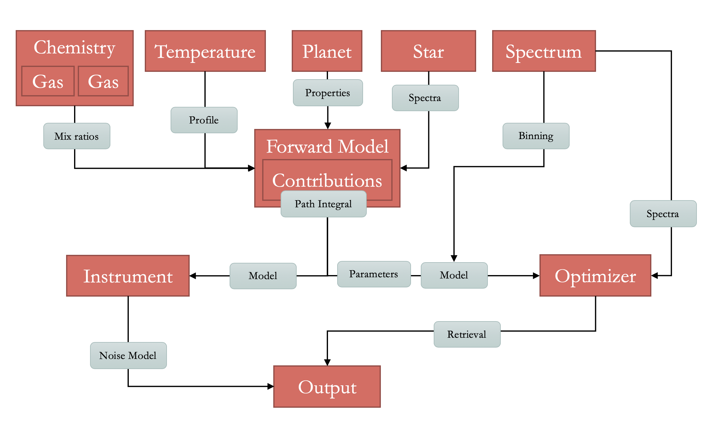

========
Overview
========

TauREx 3 follows a simply philosophy:

    *I don't care how you do it, just give it to me!*

A relevant analogy: 
We don't really care *how* a temperature profile is computed,
just as long as when we ask for one it gives it to us. 

TauREx 3 follow heavily the OOP design to achieve this. Almost everything
is split into building blocks that can be mixed and match and combined
to form a full atmospheric model and retrieval. Each of these building blocks 
are a set of *interfaces* or *guarantees* that allow to each part to work together. 

   Simple overview of how blocks connect and what they provide

These come in the form of
*abstract* or *skeleton* classes that can be taken and filled out
to form a new block in the TauREx 3 architecture.

