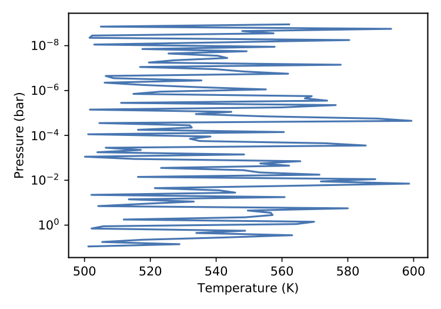

.. _buildplugin:

==================
Plugin Development
==================

Atmospheric retrievals are not an isolated science. We regularly use different codes and models from various fields
and contributors to better characterise exoplanetary systems. Often repetitive steps are needed to make use of an external code, and frequently, these are difficult to share or distribute to a broader audience.
Plugins are a new feature in TauREx 3.1 that allows developers to simplify the distribution and usage of their profile/models/chemistry etc., to other users for their retrievals.
The plugin system can be used to add the following new components:

    - :class:`~taurex.data.profiles.temperature.tprofile.TemperatureProfile`
    - :class:`~taurex.data.profiles.chemistry.chemistry.Chemistry`
    - :class:`~taurex.data.profiles.chemistry.gas.gas.Gas`
    - :class:`~taurex.data.profiles.pressure.pressureprofile.PressureProfile`
    - :class:`~taurex.data.stellar.star.Star`
    - :class:`~taurex.data.planet.Planet`
    - :class:`~taurex.model.model.ForwardModel`
    - :class:`~taurex.contributions.contribution.Contribution`
    - :class:`~taurex.opacity.opacity.Opacity`
    - :class:`~taurex.core.priors.Priors`
    - :class:`~taurex.optimizer.optimizer.Optimizer`
    - :class:`~taurex.mixin.core.Mixin`
  
Refer to the :ref:`Developers` on how to build each individual component.
This guide will outline how to package your new components into a TauREx plugin.

Anatomy of a Plugin
===================

Plugins are installable python packages that TauREx will integrate automatically into its pipeline.
Plugins can come from existing python libraries or dedicated packages. Dedicated packages only
contain TauREx components and generally have the name like ``taurex_something``. For example, 
a package that provides wrappers to the GGchem chemistry code would be called ``taurex_ggchem``
(which exists btw if you need it).

Importantly, open-source plugins should be registered to PyPI installable with a single command::
    
    > pip install taurex_myplugin

If they rely on an external FORTRAN/C++ code then they should be packaged into
a binary wheel distribution. After install the plugin will be automatically detected by TauREx::

    > taurex --plugins
    Successfully loaded plugins
    ---------------------------
    myplugin

A plugin, in its most basic form, points TauREx to the place where your components exist in your package.
This is accomplised through the ``entry_point`` parameter in ``setup.py`` of the plugin package::

    entry_points = {'taurex.plugins': 'myplugin = taurex_myplugin'}

    setup(name='taurex_myplugin',
          ..
          entry_points=entry_points,
          ..)

What this does is allow TauREx to access ``taurex_myplugin`` under ``taurex.plugins.myplugin``

Plugins can also be defined in existing packages as well. If you have a ``coolscience`` python
library and have built some TauREx components under ``coolscience.taurex`` then you can add to
your ``entry_point``::

    entry_points = {'taurex.plugins': 'coolscience = coolscience.taurex',
                    # ... other entrypoints
                    }

    setup(name='coolscience',
          ...
          entry_points=entry_points,
          ...)

The package will still be installable without TauREx. If later on someone installs TauREx then
they automatically get the plugin for free! Neat!

TauREx Hello World!
===================

Lets create a first plugin ``taurex_helloworld`` where 
we will define a new component: a randomized temperature profile. 
First we setup our folder structure::

    taurex_helloworld/
        __init__.py
        randomtemp.py
    LICENSE
    README.md
    setup.py

setup.py
--------

The most essential part is the :file:`setup.py` file to install the package and plugin.
The following is something you can work with::

    #!/usr/bin/env python
    import setuptools
    from setuptools import find_packages
    from setuptools import setup

    packages = find_packages(exclude=('tests', 'doc'))
    provides = ['taurex_helloworld', ]

    requires = []

    install_requires = ['taurex', ]

    entry_points = {'taurex.plugins': 'helloworld = taurex_helloworld'}

    setup(name='taurex_helloworld',
          url='http://example.com/taurex_helloworld',
          license='BSD',
          author='Your Name',
          author_email='your-email@example.com',
          description='Very short description',
          long_description=__doc__,
          packages=packages,
          entry_points=entry_points,
          provides=provides,
          requires=requires,
          install_requires=install_requires)

randomtemp.py
-------------

This is our random temperature profile, we will steal the implementation from
:ref:`customtypes` and change it a little:

.. code-block:: python

    from taurex.temperature import TemperatureProfile
    from taurex.core import fitparam
    import numpy as np

    class RandomTemperature(TemperatureProfile):

        def __init__(self, base_temp=1500.0,
                    random_scale=10.0):
            super().__init__(self.__class__.__name__)

            self._base_temp = base_temp
            self._random_scale = random_scale

        # -----Fitting Parameters--------------

        @fitparam(param_name='rand_scale',param_latex='rand')
        def randomScale(self):
            return self._random_scale

        @randomScale.setter
        def randomScale(self, value):
            self._random_scale = value

        @fitparam(param_name='base_T',param_latex='$T_{base}$')
        def baseTemperature(self):
            return self._base_temp

        @baseTemperature.setter
        def baseTemperature(self, value):
            self._base_temp = value

        # -------Actual calculation -----------

        @property
        def profile(self):
            return self._base_temp + \
                        np.random.rand(self.nlayers) * self._random_scale
        
        BIBTEX_ENTRIES = [
            """
            @article{myart,
                title={School of Life}, 
            """
        ]

        # -----Plugin related------------------

        @classmethod
        def input_keywords(cls):
            return ['helloworld', 'helloearth', 'hello-world',]

As before a terrible temperature profile we now include two extra parameters.
The class method ``input_keywords`` informs TauREx on how this temperature profile
is selected in the input file. It must return a list and can include more than one keyword.
If this plugin is installed we can use the profile through one of those keywords::

    [Temperature]
    profile_type = helloworld    # Valid keyword RandomTemperature
    # profile_type = helloearth  # Also valid
    # profile_type = hello-world # Also valid

The ``BIBTEX_ENTRIES`` parameter is used by TauREx to list relevant publications
involved with the atmospheric compoenent. See :ref:`basics` for more information.

__init__.py
-----------

We can use :file:`__init__.py` to expose the temperature profile to TauREx
by importing it like so:

.. code-block:: python

    from .randomtemp import RandomTemperature

.. tip::

    You could also just point the ``entry_point`` to ``taurex_helloworld.randomtemp``.
    However we recommend either putting it in an :file:`__init__.py` or defining
    another python file that includes these imports. This allows you to include
    components from different files and allows you to be selective on what to 
    expose to TauREx

Using our plugin
----------------

To use our plugin we can now do::

    pip install .

Running ``taurex --plugins`` we see::

    Successfully loaded plugins
    ---------------------------
    helloworld

Our plugin has now been loaded into TauREx! We can also see that our temperature
profile was detected as well by doing ``taurex --keywords temperature``::

    ╒═══════════════════════════════════════╤═══════════════════╤════════════╕
    │ profile_type                          │ Class             │ Source     │
    ╞═══════════════════════════════════════╪═══════════════════╪════════════╡
    │ file / fromfile                       │ TemperatureFile   │ taurex     │
    ├───────────────────────────────────────┼───────────────────┼────────────┤
    │ isothermal                            │ Isothermal        │ taurex     │
    ├───────────────────────────────────────┼───────────────────┼────────────┤
    │ guillot / guillot2010                 │ Guillot2010       │ taurex     │
    ├───────────────────────────────────────┼───────────────────┼────────────┤
    │ npoint                                │ NPoint            │ taurex     │
    ├───────────────────────────────────────┼───────────────────┼────────────┤
    │ helloworld / helloearth / hello-world │ RandomTemperature │ helloworld │
    ├───────────────────────────────────────┼───────────────────┼────────────┤
    │ rodgers / rodgers2010                 │ Rodgers2000       │ taurex     │
    ╘═══════════════════════════════════════╧═══════════════════╧════════════╛

Now we can write in the input file::

    [Temperature]
    profile_type = helloworld
    base_temp = 500.0
    random_scale = 100.0

Which gives us

   *Still* terrible

