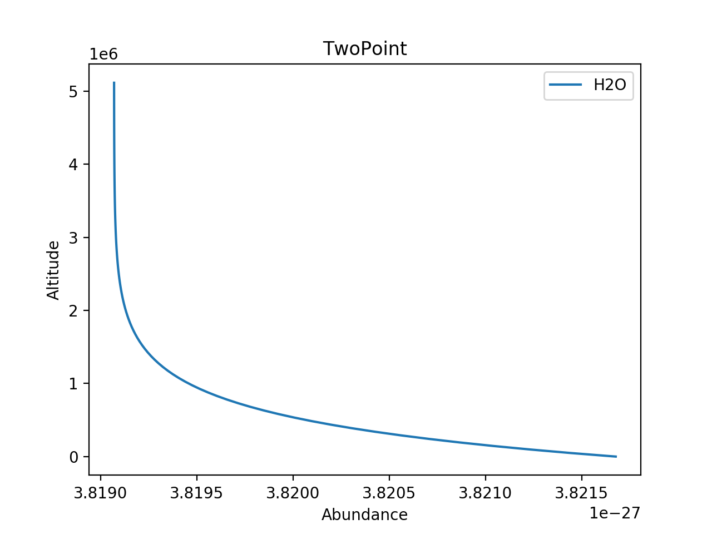

.. _chemistry:

===============
``[Chemistry]``
===============

This header describes the chemical composition of the
atmosphere. The type of model used is defined by the
``chemistry_type`` variable.

The available ``chemistry_type`` are:
    - ``ace``
        - ACE equlibrium chemistry
        - Class: :class:`~taurex.data.profiles.chemistry.acechemistry.ACEChemistry`

    - ``taurex``
        - Free chemistry
        - Class: :class:`~taurex.data.profiles.chemistry.taurexchemistry.TaurexChemistry`
    
    - ``custom``
        - User-provided chemistry

========================
ACE Equlibrium Chemistry
========================
``chemistry_type = ace``
``chemistry_type = equilibrium``

Equilibrium chemistry using the ACE FORTRAN program.

--------
Keywords
--------

+-----------------+--------------+------------------------------------+---------------+
| Variable        | Type         | Description                        | Default Value |
+-----------------+--------------+------------------------------------+---------------+
| ``metallicity`` | :obj:`float` | Stellar metallicity in solar units | 1.0           |
+-----------------+--------------+------------------------------------+---------------+
| ``co_ratio``    | :obj:`float` | C/O ratio                          | 0.54951       |
+-----------------+--------------+------------------------------------+---------------+

------------------
Fitting Parameters
------------------

+---------------------+--------------+------------------------------------+
| Parameter           | Type         | Description                        |
+---------------------+--------------+------------------------------------+
| ``ace_metallicity`` | :obj:`float` | Stellar metallicity in solar units |
+---------------------+--------------+------------------------------------+
| ``ace_co``          | :obj:`float` | C/O ratio                          |
+---------------------+--------------+------------------------------------+

Taurex Chemistry
===========================
``chemistry_type = taurex``

This chemistry type allows you to define individual
abundance profiles for each molecule. Molecules are either active or inactive depending on
whats available. If no cross-sections are available then the moelcule is not actively absorbing.

On its own it has the variables:
    - ``fill_gases``
        - str or :obj:`list`
        - Gas or gases to fill the atmosphere with
        - Default: ``fill_gases = H2,He,``

    - ``ratio``
        - float
        - If a pair of fill gases are defined, then this is the ratio between the two
        - Default: ``ratio = 0.17647``

However molecules are defined as *subheaders* with the subheader being the name of the molecule.
Each molecule can be assigned an abundance profile through the ``gas_type`` variable.
For example, to describe a chemical profile with water in constant abundance in the atmosphere 
is simply done like so::

    [Chemistry]
    chemistry_type = taurex
    ratio = 0.1524

        [[H2O]]
        gas_type = constant
        mix_ratio = 1e-4

For each molecule, the available ``gas_type`` are:
    - ``constant``
       - Constant abundance profile
       - Class: :class:`~taurex.data.profiles.chemistry.gas.constantgas.ConstantGas`

    - ``twopoint``
        - Two Point abundance profile
        - Class: :class:`~taurex.data.profiles.chemistry.gas.twopointgas.TwoPointGas`
    
    - ``twolayer``
        - Two layer abundance profile
        - Class: :class:`~taurex.data.profiles.chemistry.gas.twolayergas.TwoLayerGas`

Constant Profile
----------------
``gas_type = constant``

An abundance profile that is constant with height of the atmosphere

.. figure::  _static/constantgas.png
   :align:   left
   :width: 80%

Variables are:
    - ``mix_ratio``
        - float
        - The abundance for every layer in the atmosphere

Two Point Profile
-----------------
``gas_type = twopoint``

An abundance profile where abundance is defined on the planet surface and top of
the atmosphere and interpolated

Variables are:
    - ``mix_ratio_surface``
        - float
        - Abundance on the planet surface
    - ``mix_ratio_top``
        - float
        - Abundance on the top of that atmosphere

Two Layer Profile
-----------------
``gas_type = twolayer``

An abundance profile where abundance is defined on the planet surface and top of
the atmosphere with a pressure point determining the boundary between the layers.
Smoothing is applied.

.. figure::  _static/twolayerabundance.png
   :align:   left
   :width: 80%

Variables are:
    - ``mix_ratio_surface``
        - float
        - Abundance on the planet surface
    - ``mix_ratio_top``
        - float
        - Abundance on the top of that atmosphere
    - ``mix_ratio_P``
        - float
        - Pressure point that seperates the top and surface
    - ``mix_ratio_smoothing``
        - int
        - Smoothing window