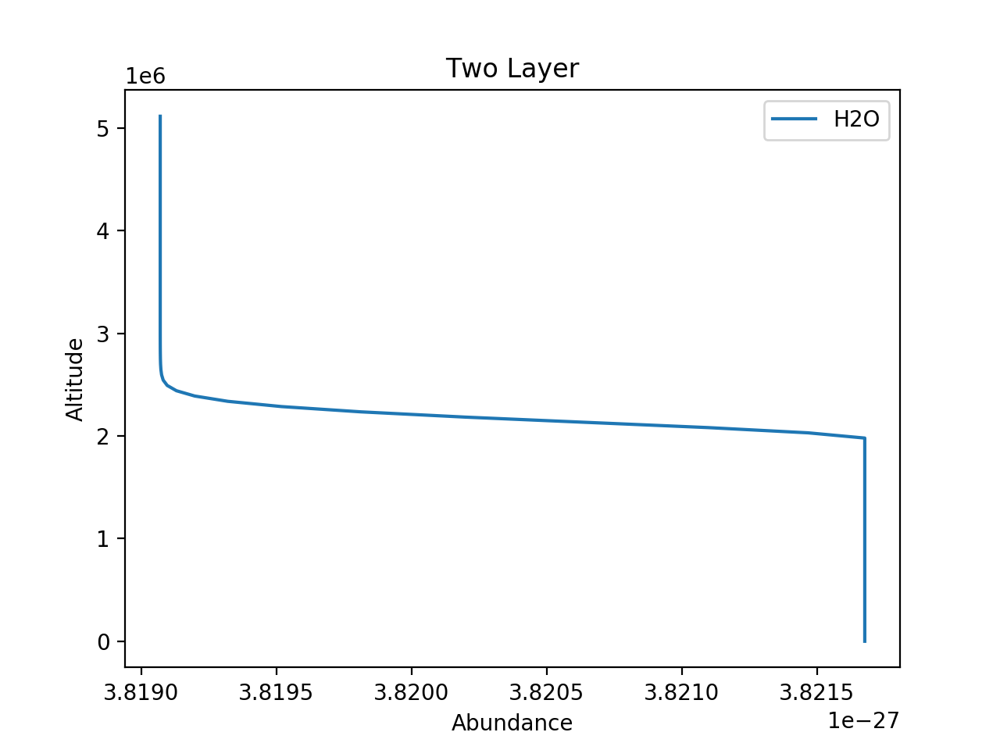

.. _chemistry:

===============
``[Chemistry]``
===============

This header describes the chemical composition of the
atmosphere. The type of model used is defined by the
``chemistry_type`` variable.

The available ``chemistry_type`` are:
    - ``ace``
        - ACE equlibrium chemistry
        - Class: :class:`~taurex.data.profiles.chemistry.acechemistry.ACEChemistry`

    - ``taurex``
        - Free chemistry
        - Class: :class:`~taurex.data.profiles.chemistry.taurexchemistry.TaurexChemistry`
    
    - ``custom``
        - User-provided chemistry

------------------------------------

ACE Equlibrium Chemistry
========================
``chemistry_type = ace``
``chemistry_type = equilibrium``

Equilibrium chemistry using the ACE FORTRAN program.

--------
Keywords
--------

+-----------------+--------------+------------------------------------+---------------+
| Variable        | Type         | Description                        | Default Value |
+-----------------+--------------+------------------------------------+---------------+
| ``metallicity`` | :obj:`float` | Stellar metallicity in solar units | 1.0           |
+-----------------+--------------+------------------------------------+---------------+
| ``co_ratio``    | :obj:`float` | C/O ratio                          | 0.54951       |
+-----------------+--------------+------------------------------------+---------------+

------------------
Fitting Parameters
------------------

+---------------------+--------------+------------------------------------+
| Parameter           | Type         | Description                        |
+---------------------+--------------+------------------------------------+
| ``ace_metallicity`` | :obj:`float` | Stellar metallicity in solar units |
+---------------------+--------------+------------------------------------+
| ``ace_co``          | :obj:`float` | C/O ratio                          |
+---------------------+--------------+------------------------------------+

--------------------------------------

Taurex Chemistry
================
``chemistry_type = taurex``
``chemistry_type = free``

This chemistry type allows you to define individual
abundance profiles for each molecule. Molecules are either active or inactive depending on
whats available. If no cross-sections are available then the moelcule is not actively absorbing.

--------
Keywords
--------

+----------------+-----------------------------+---------------------------+---------+
| Variable       | Type                        | Description               | Default |
+----------------+-----------------------------+---------------------------+---------+
|                |                             | Gas or gases to fill the  | H2,He,  |
| ``fill_gases`` | :obj:`str` or :obj:`list`   | atmosphere with           |         |
+----------------+-----------------------------+---------------------------+---------+
|                |                             | Ratio between first fill  | 0.749   |
| ``ratio``      | :obj:`float` or :obj:`list` | gas and every other fill  |         |
|                |                             | gas                       |         |
+----------------+-----------------------------+---------------------------+---------+

------------------
Fitting Parameters
------------------

On its own, this chemistry model provides fitting parameters relating to the fill gases used.
These are only created when more than one fill gas is defined.
Here, we use ``[Gas-0]`` to designate the first gas defined in the fill gas list and
``[Gas-(number)]`` to designate the nth gas after the main gas. If we have a
gas list like::

    fill_gases = H2,He,CO2,

then ``[Gas-1]_[Gas-0] == He_H2``

+-----------------------+-----------------------------+---------------------------+
| Parameter             | Type                        | Description               |
+-----------------------+-----------------------------+---------------------------+
|                       |                             |                           |
| ``[Gas-(n)]_[Gas-0]`` | :obj:`float`                | Ratio of nth fill gas     |
|                       |                             | vs first fill gas         |
+-----------------------+-----------------------------+---------------------------+

However molecules are defined as *subheaders* with the subheader being the name of the molecule.
Each molecule can be assigned an abundance profile through the ``gas_type`` variable.
For example, to describe a chemical profile with water in constant abundance in the atmosphere 
is simply done like so::

    [Chemistry]
    chemistry_type = taurex
    fill_gases = H2,He,
    ratio = 0.1524

        [[H2O]]
        gas_type = constant
        mix_ratio = 1e-4

For each molecule, the available ``gas_type`` are:
    - ``constant``
       - Constant abundance profile
       - Class: :class:`~taurex.data.profiles.chemistry.gas.constantgas.ConstantGas`

    - ``twopoint``
        - Two Point abundance profile
        - Class: :class:`~taurex.data.profiles.chemistry.gas.twopointgas.TwoPointGas`
    
    - ``twolayer``
        - Two layer abundance profile
        - Class: :class:`~taurex.data.profiles.chemistry.gas.twolayergas.TwoLayerGas`

-----------------------------------------

Gas Profiles
============

For these profiles, the fitting parameters generated have
the name associated with the name of the molecule. For example:
``H2O_P``, ``CH4_S`` etc. Because of this, we will use the moniker:
``[Mol]``. Replacing this with the appropriate molecule will give you
the correct fitting parameter name.
e.g. ``[Mol]_surface`` should be ``H2O_surface`` for water etc.

Constant Profile
================

``gas_type = constant``

An abundance profile that is constant with height of the atmosphere

.. figure::  _static/constantgas.png
   :align:   left
   :width: 80%

--------
Keywords
--------
+---------------+-----------------------------+---------------------------+---------+
| Variable      | Type                        | Description               | Default |
+---------------+-----------------------------+---------------------------+---------+
| ``mix_ratio`` | :obj:`float`                | Mixing ratio of molecule  | 1e-4    |
+---------------+-----------------------------+---------------------------+---------+

------------------
Fitting Parameters
------------------

+-----------+-----------------------------+---------------------------+
| Parameter | Type                        | Description               |
+-----------+-----------------------------+---------------------------+
| ``[Mol]`` | :obj:`float`                | Mixing ratio of molecule  |
+-----------+-----------------------------+---------------------------+

--------------------------------------

Two Layer Profile
=================
``gas_type = twolayer``

An abundance profile where abundance is defined on the planet surface and top of
the atmosphere with a pressure point determining the boundary between the layers.
Smoothing is applied.

--------
Keywords
--------

+-------------------------+--------------+------------------------+---------+
| Variable                | Type         | Description            | Default |
+-------------------------+--------------+------------------------+---------+
| ``mix_ratio_surface``   | :obj:`float` | Mixing ratio at BOA    | 1e-4    |
+-------------------------+--------------+------------------------+---------+
| ``mix_ratio_top``       |              | Mixing ratio at TOA    | 1e-8    |
|                         | :obj:`float` |                        |         |
+-------------------------+--------------+------------------------+---------+
| ``mix_ratio_P``         | :obj:`float` | Pressure boundary (Pa) | 1e3     |
+-------------------------+--------------+------------------------+---------+
| ``mix_ratio_smoothing`` | :obj:`int`   | Smoothing window       | 10      |
+-------------------------+--------------+------------------------+---------+

------------------
Fitting Parameters
------------------

+-------------------+--------------+------------------------+
| Parameter         | Type         | Description            |
+-------------------+--------------+------------------------+
| ``[Mol]_surface`` | :obj:`float` | Mixing ratio at BOA    |
+-------------------+--------------+------------------------+
| ``[Mol]_top``     | :obj:`float` | Mixing ratio at TOA    |
+-------------------+--------------+------------------------+
| ``[Mol]_P``       | :obj:`float` | Pressure boundary (Pa) |
+-------------------+--------------+------------------------+

.. Two Point Profile
.. =================
.. ``gas_type = twopoint``

.. An abundance profile where abundance is defined on the planet surface and top of
.. the atmosphere and interpolated

.. .. figure::  _static/twopointgas.png
..    :align:   left
..    :width: 80%

.. Variables are:
..     - ``mix_ratio_surface``
..         - float
..         - Abundance on the planet surface
..     - ``mix_ratio_top``
..         - float
..         - Abundance on the top of that atmosphere

.. --------
.. Keywords
.. --------

.. ------------------
.. Fitting Parameters
.. ------------------

