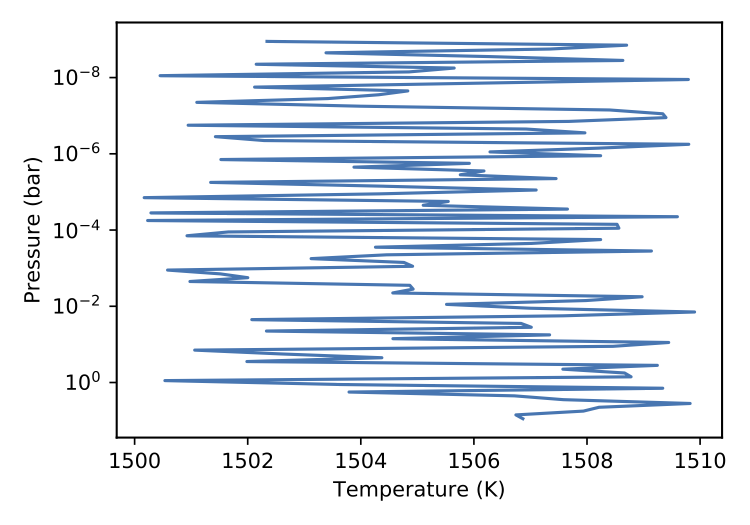
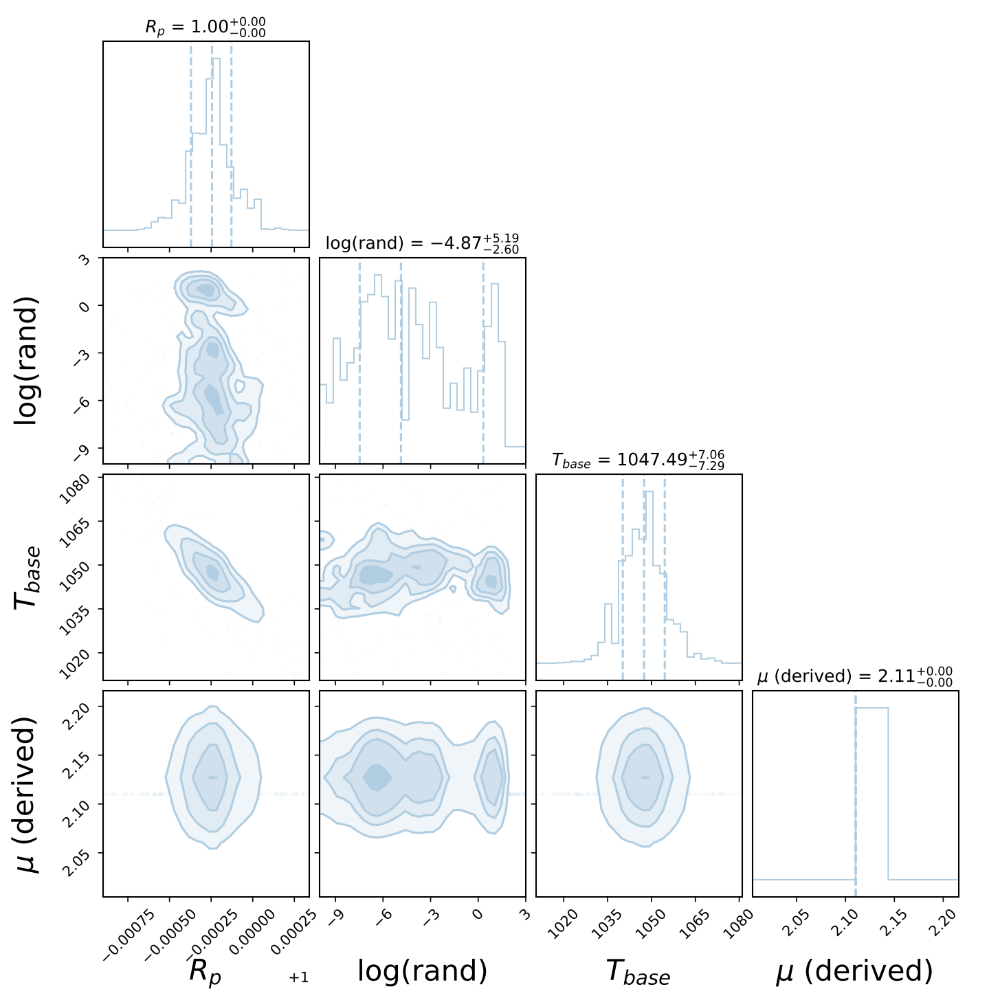

.. _customtypes:

============
Custom Types
============

Direct Method
-------------

Across many of the atmospheric parameters/sections you'll
come across the ``custom`` type. These allow you to inject your
own code to be used in the forward model and retrieval scheme.

Developing or wrapping your own parameters is discussed in the
:ref:`Developers`.

Lets take a simple example. Imagine you have your own amazing
temperature profile and you've written a TauREx 3 class for it:

.. code-block:: python

    from taurex.temperature import TemperatureProfile
    from taurex.core import fitparam
    import numpy as np

    class RandomTemperature(TemperatureProfile):

        def __init__(self, base_temp=1500.0,
                    random_scale=10.0):
            super().__init__(self.__class__.__name__)

            self._base_temp = base_temp
            self._random_scale = random_scale

        # -----Fitting Parameters--------------

        @fitparam(param_name='rand_scale',param_latex='rand')
        def randomScale(self):
            return self._random_scale

        @randomScale.setter
        def randomScale(self, value):
            self._random_scale = value

        @fitparam(param_name='base_T',param_latex='$T_{base}$')
        def baseTemperature(self):
            return self._base_temp

        @baseTemperature.setter
        def baseTemperature(self, value):
            self._base_temp = value

        # -------Actual calculation -----------

        @property
        def profile(self):
            return self._base_temp + \
                        np.random.rand(self.nlayers) * self._random_scale

Ok ok this is a **terrible** temperature profile, essentially it is randomizing
around a *base* temperature given but I digress. We can easily include it in taurex
by pointing it to the file::

    [Temperature]
    profile_type = custom
    python_file = /path/to/rand_temperature.py

Thats it!! When you change a type (i.e ``profile_type``, ``model_type`` etc.) to ``custom``
the new keyword ``python_file`` is available which should point to the python file with the class
you want. We can run TauREx3 with it and see that it has indeed accepted it::

    taurex -i input.par -o randtemp_test.h5
    taurex-plot -i randtemp_test.h5 -o myplots/ --plot-tpprofile

Which gives:

   Truly terrible

Now we can do a little more with this as well. When TauREx3 is given
a new class it will scan for initialization keywords and *embed them as new input keywords*.
Looking at the class, the initialization keywords are ``base_temp`` and ``random_scale``
this means we can put them as parameters in the input file::

    [Temperature]
    profile_type = custom
    python_file = /path/to/rand_temperature.py
    base_temp = 500.0
    random_scale = 100.0

And plotting again we see that the profile has now changed to reflect this:

.. figure::  _static/random_tp_500.png
   :align:   center

   Truly terrible at 500.0 K

Finally, it is entriely possible to perform retrievals with our new profile,
since TauREx3 will also *discover new fitting parameters*. Our profile
has the fitting parameters ``base_T`` and ``rand_scale`` so we can add them to our
``[Fitting]`` section::

    [Fitting]
    planet_radius:fit = True
    planet_radius:bounds = 0.8, 2.0

    base_T:fit = True
    base_T:bounds = 500.0, 3000.0
    rand_scale:mode = log
    rand_scale:fit = True
    rand_scale:bounds = 1e-10, 1000.0

Of course we get all the benefits of native fitting parameters like the ability
to switch between ``linear`` and ``log`` scale. Now we can perform a retrieval
and plot posteriors like so::

    taurex -i input.par -o randtemp_retrieval.h5 --retrieval
    taurex-plot -i randtemp_retrieval.h5 -o myplots_retrieval/ --plot-posteriors

   Truly terrible posteriors

Which correctly adds in the latex parameters as well, it even inserted *log* for us! 
Of course the retrieval just went ahead and tried to minimize the randomness which makes sense!
Almost all parameters have some custom functionality. The ones that do not have this
are ``[Binning]`` and ``[Global]``.
Try it out!

--------------------------------

Here is the full ``input.par`` file::

    [Global]
    xsec_path = /path/to/xsecfiles
    cia_path = /path/to/ciafiles

    # ----Forward Model related -----------

    [Chemistry]
    chemistry_type = taurex
    fill_gases = H2,He
    ratio = 4.8962e-2

        [[H2O]]
        gas_type = constant
        mix_ratio=1.1185e-4

        [[N2]]
        gas_type = constant
        mix_ratio = 3.00739e-9

    [Temperature]
    profile_type = custom
    python_file = rand_temperature.py
    base_temp = 1000.0
    random_scale = 100.0

    [Pressure]
    profile_type = Simple
    atm_min_pressure = 1e-4
    atm_max_pressure = 1e6
    # Use 10 layers to keep retrieval time down
    nlayers = 10 

    [Planet]
    planet_type = Simple
    planet_mass = 1.0 
    planet_radius = 1.0

    [Star]
    star_type = blackbody

    [Model]
    model_type = transmission
        
        [[Absorption]]
        
        [[CIA]]
        cia_pairs = H2-He,H2-H2
        
        [[Rayleigh]]

    # ---------Creating an observation for retrieval--------
    # We use instruments to create an observation
    # Rather than passing in a text file

    [Binning]
    bin_type = manual
    accurate = False
    wavelength_res = 0.6,4.1,100 # Start end 

    [Instrument]
    instrument = snr
    SNR = 20

    [Observation]
    taurex_spectrum = self

    # ------Retrieval related --------------

    [Optimizer]
    optimizer = nestle
    # Use small number of live points to minimize
    # retrieval time
    num_live_points = 50

    [Fitting]
    planet_radius:fit = True
    planet_radius:factor = 0.8, 2.0

    base_T:fit = True
    base_T:bounds = 500.0, 3000.0
    rand_scale:mode = log
    rand_scale:fit = True
    rand_scale:bounds = 1e-10, 1000.0

Extension Path Method
---------------------

Another way to include your own code is by setting the ``extension_path``
variable under :ref:`userglobal`. If our python file exists in a folder say::

    mycodes/
        rand_temperature.py

We can set the path to ``extension_path`` variable to point to the folder::

    [Global]
    extension_path = /path/to/mycodes/

We will need to make one small modification and add the ``input_keywords`` class method
to our temperature profile. (See :ref:`basics`):

.. code-block:: python

    @classmethod
    def input_keywords(cls):
        return ['my-random-temperature',]

TauREx will now search for ``.py`` files in the directory, attempt to load them and then automatically
integrate them into the TauREx pipeline!!! We can use the value return by ``input_keywords`` to select our
profile::

    [Temperature]
    profile_type = my-random-temperature
    base_temp = 1000.0
    random_scale = 100.0

Cool!!!

Limitations
-----------

The custom system is intended for quick development and inclusion of new components or file formats. There are
as few limitations when using it.

First each file is loaded in isolation, therefore referencing another python file in the same directory will yield errors,
for example if we have this directory::

    mycodes/
        rand_temperature.py
        util.py

And we attempt to import :file:`util` in :file:`rand_temperature.py` then it will fail.

The *Direct Method* does not support loading in :class:`~taurex.opacity.opacity.Opacity` and
:class:`~taurex.contributions.contribution.Contribution` types.

If you feel like you need more control and flexibility with your extensions or if it is useful to the community as a whole
then we suggest trying :ref:`buildplugin`

