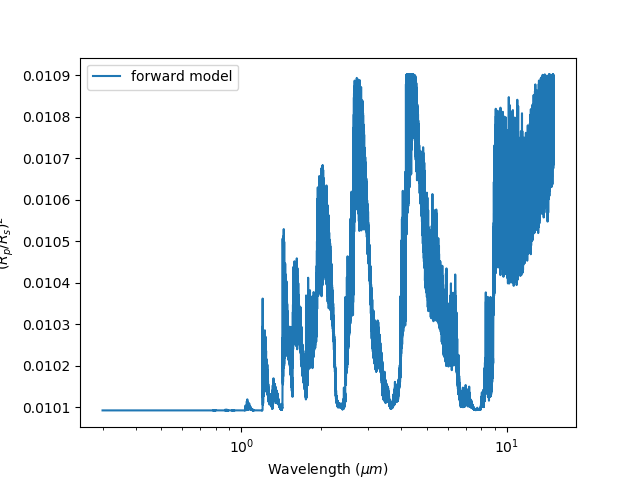
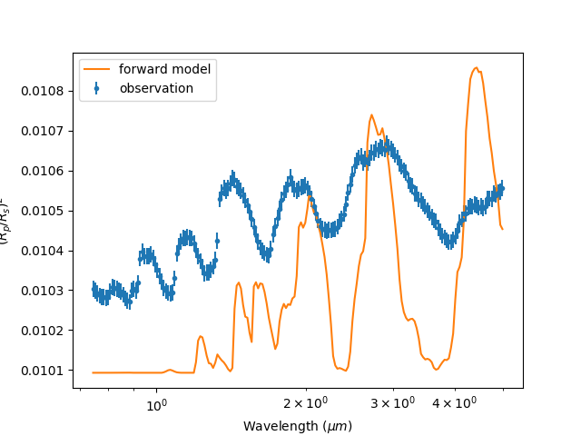
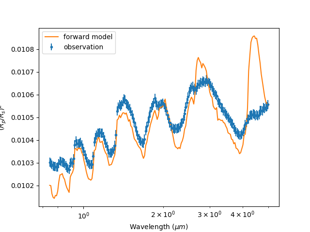
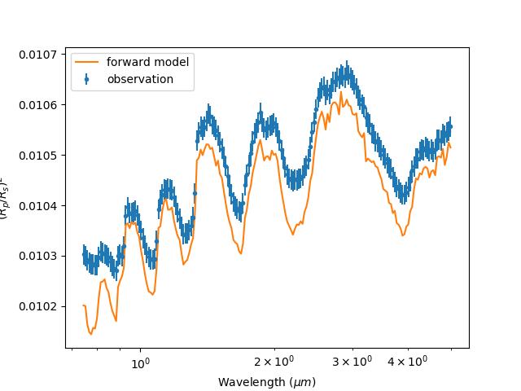
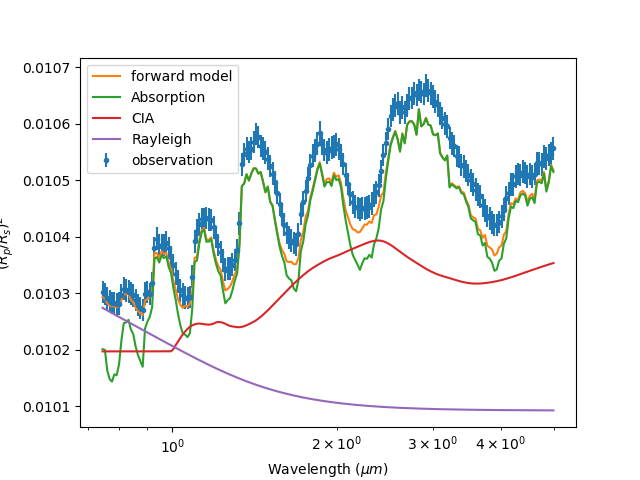
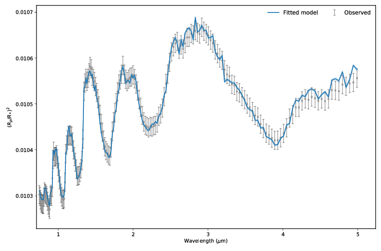
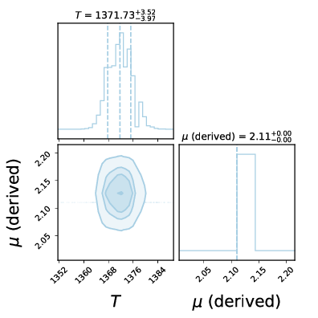

.. _quickstart:

==========
Quickstart
==========

To get quickly up to speed lets try an example run using TauREx3. We will be using the ``examples/parfiles/quickstart.par``
file as a starting point and ``examples/parfiles/quickstart.dat`` as our observation. Copy these to a new folder somewhere.

Prerequisites
-------------

Before reading this you should have a few things on hand. Firstly ``H2O`` and ``CO2`` absorption cross sections
in one of the :ref:`supported_data_formats` is required. This example assumes cross-sections at *R=10000*.
Secondly some collisionally induced absorption (CIA) cross sections are also
required for a later part for ``H2-He`` and ``H2-H2``, you can get these from the HITRAN_ site. 

.. tip::
    A starter set of these cross-sections and cia can be found in this dropbox: https://www.dropbox.com/sh/13y33d02vh56jh2/AABxuHdrZI83bSgoLz1Wzb2Fa?dl=0

Setup
------
In order to begin running forward models we need to tell *TauREx3* where our cross-sections are.
We can do this by defining an ``xsec_path`` for cross sections and ``cia_path`` for CIA cross-sections under the
``[Global]`` header in our ``quickstart.par`` files like so::

    [Global]
    xsec_path = /path/to/xsec
    cia_path = /path/to/cia

Forward Model
-------------

Using our input we can run and plot the forward model by doing::

    taurex -i quickstart.par --plot

And we should get:

   Our first forward model

Lets try plotting it against our observation. Under the ``[Observation]`` header
we can add in the ``observed_spectrum`` keyword and point it to our ``quickstart.dat`` file like so::

    [Observation]
    observed_spectrum = /path/to/quickstart.dat

Now the spectrum will be binned to our observation:

   Our binned observation

You may notice that general structure and peaks don't seem to match up with observation.
Our model doesn't seem to do the job and it may be the fault of our choice of molecule. Lets move on to chemistry.

Chemistry
---------

As we've seen, ``CO2`` doesn't fit the observation very well, we should try adding in another molecule.
Underneath the ``[Chemistry]`` section we can add another sub-header with the name of our molecule, for this 
example we will use a ``constant`` gas profile which keeps it abundance constant throughout the atmosphere,
there are other more complex profiles but for now we'll keep it simple::

    [Chemistry]
    chemistry_type = taurex
    fill_gases = H2,He
    ratio=4.8962e-2

        [[H2O]]
        gas_type = constant
        mix_ratio=1.1185e-4

        [[CO2]]
        gas_type=constant
        mix_ratio=1.1185e-4

        [[N2]]
        gas_type = constant
        mix_ratio = 3.00739e-9

Plotting it gives:

We're getting there. It looks like H2O is definately there but maybe ``CO2`` isn't? Lets try it
by commenting it out::

    [Chemistry]
    chemistry_type = taurex
    fill_gases = H2,He
    ratio=4.8962e-2

        [[H2O]]
        gas_type = constant
        mix_ratio=1.1185e-4

        #[[CO2]]
        #gas_type=constant
        #mix_ratio=1.1185e-4

        [[N2]]
        gas_type = constant
        mix_ratio = 3.00739e-9

Much much better! We're still missing something though...

Contributions
-------------

It seems moelcular absorption is not the only process happening in the atmosphere. Looking at the shorter
wavelengths we see the characteristic behaviour of **Rayleigh scattering** and a little from **collisionally**
**induced** **absorption**. We can easily add these contributions under the ``[Model]`` section of the input file.
Each *contribution* is represented as a subheader with additional arguments if necessary. By default we have
contributions from molecular ``[[Absorption]]`` 
Lets add in some ``[[CIA]]`` from ``H2-H2`` and ``H2-He`` and ``[[Rayleigh]]`` scattering to the model::

    [Model]
    model_type = transmission

        [[Absorption]]

        [[CIA]]
        cia_pairs = H2-He,H2-H2

        [[Rayleigh]]

.. image::  _static/ray_and_cia.png

Hey not bad!! It might be worth seeing how each of these processes effect the spectrum. Easy, we can run
``taurex`` with the ``-c`` argument which plots the basic contributions::

    taurex -i quickstart.par --plot -c

If you want a more detailed look of the each contribution you can use the ``-C`` option instead::

    taurex -i quickstart.par --plot -C

.. image::  _static/full_contrib.png

Pretty cool. We're almost there. Lets save what we have now to file.

Storage
-------

``Taurex3`` uses the HDF5_ format to store its state and results. We can accomplish this by 
using the ``-o`` output argument::

    taurex -i quickstart.par -o myfile.hdf5

We can use this output to plot profiles spectra and even the optical depth!
Try::

    taurex-plot -i myfile.h5 -o fm_plots/ --all

To plot everything:

.. list-table::

    * - .. figure:: _static/fm_plots/fm_plots-0.png
            :align: center

            Chemistry

      - .. figure:: _static/fm_plots/fm_plots-1.png
            :align: center

            Spectrum

    * - .. figure:: _static/fm_plots/fm_plots-2.png
            :align: center

            Contributions

      - .. figure:: _static/fm_plots/fm_plots-3.png
            :align: center

            Optical depth

``HDF5`` has many viewers such as HDFView_ or HDFCompass_ and APIs such as Cpp_, FORTRAN_ and Python_.
Pick your poison. 

Retrieval
---------

So we're close to the observation but not quite there and I suspect its the 
temperature profile. We should try running a retrieval. We will use nestle_ as our optimizer of choice
but other brands are available. This has already be setup under the ``[Optimizer]`` section of the input 
file so we will not worry about it now. We now need to inform the optimizer what parameters we need to fit.
The ``[Fitting]`` section should list all of the parameters in our model that we want (or dont want) to fit 
and *how* to go about fitting it. By default the ``planet_radius`` parameter is fit when no section is provided,
we should start by creating our ``[Fitting]`` section and disabling the ``planet_radius`` fit::
    
    [Fitting]
    planet_radius:fit = False

the syntax is pretty simple, its essentially ``parameter_name:option`` with ``option`` being either 
``fit``, ``bounds`` and ``mode``. ``fit`` is simply tells the optimizer whether to fit the parameter, ``bounds``
describes the parameter space to optimize in and ``mode`` instructs the optimizer to fit in either ``linear``
or ``log`` space.
The parameter we are interested in is isothermal temperature which is represented as ``T``, and we will fit
it within *1200 K* and *1400 K*::

    [Fitting]
    planet_radius:fit = False
    T:fit = True
    T:bounds = 1200.0,1400.0

We don't need to include ``mode`` as by default ``T`` fits in linear space. Some parameters such as
abundances fit in log space by default.

Running taurex like before will just plot our forward model. To run the retrieval we simply add
the ``--retrieval`` keyword like so::

    taurex -i quickstart.par --plot -o myfile_retrieval.hdf5 --retrieval

We should now see something like this pop up::

    taurex.Nestle - INFO - -------------------------------------
    taurex.Nestle - INFO - ------Retrieval Parameters-----------
    taurex.Nestle - INFO - -------------------------------------
    taurex.Nestle - INFO - 
    taurex.Nestle - INFO - Dimensionality of fit: 1
    taurex.Nestle - INFO - 
    taurex.Nestle - INFO - 
    Param      Value    Bound-min    Bound-max
    -------  -------  -----------  -----------
    T        1265.98         1200         1400

    taurex.Nestle - INFO - 
    it=   393 logz=1872.153686niter: 394

It should only take a few minutes to run. Once done we should get an output like this::

    ---Solution 0------
    taurex.Nestle - INFO - 
    Param        MAP    Median
    -------  -------  --------
    T        1375.97   1371.71

So the temperature should have been around *1370 K*, huh, and lets see how it looks. Lets plot the output::

    taurex-plot -i myfile_retrieval.hdf5 -o retrieval_plots/ --all

Our final spectrum looks like:

    
    Final result

We can then see the posteriors:

    
    Posteriors

Thats the basics of playing around with TauREx 3. You can
try modifying the quickstart to do other things! Take a look at
:ref:`inputfile` to see a list of parameters you can change!

.. _HITRAN: https://hitran.org/cia/

.. _HDF5: https://www.hdfgroup.org/solutions/hdf5/

.. _HDFView: https://www.hdfgroup.org/downloads/hdfview/

.. _nestle: https://github.com/kbarbary/nestle

.. _HDFCompass: https://support.hdfgroup.org/projects/compass/

.. _FORTRAN: https://support.hdfgroup.org/HDF5/doc/fortran/index.html

.. _Cpp: https://support.hdfgroup.org/HDF5/doc/cpplus_RM/index.html

.. _Python: https://www.h5py.org/