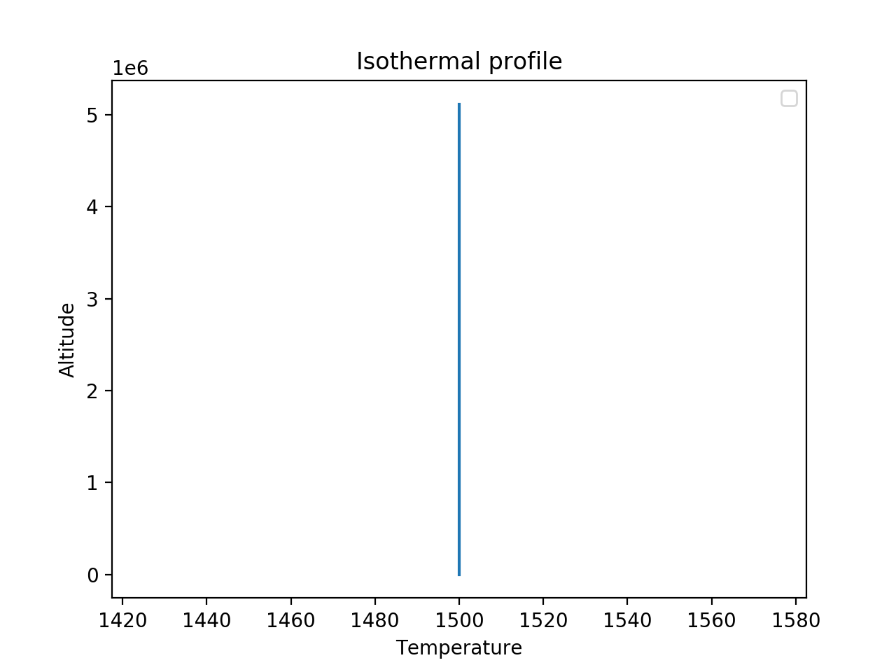
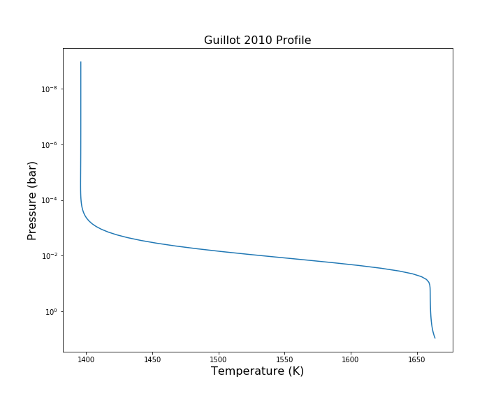
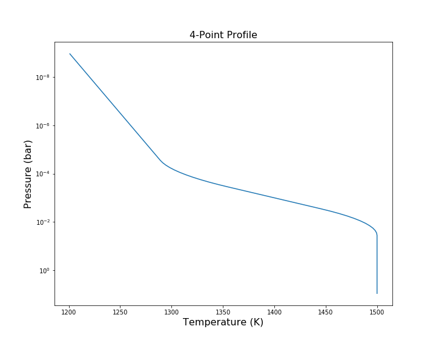
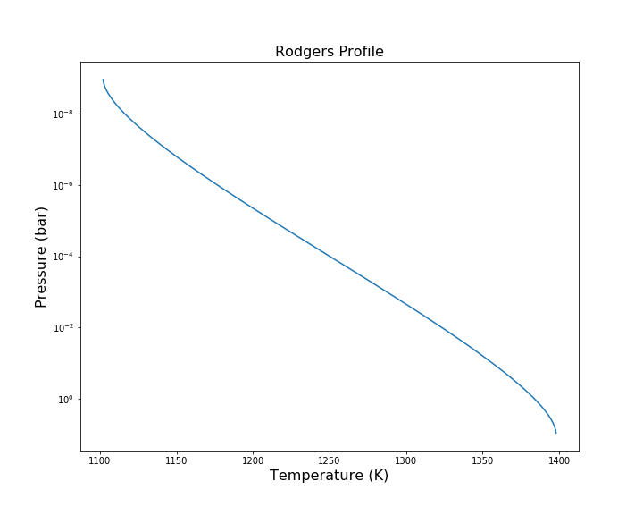

.. _temperature:

*****************
``[Temperature]``
*****************

This header is used to define temperature profiles for the atmosphere.
The type of temperature profile is defined by the ``profile_type`` variable

The available ``profile_type`` are:
    - ``isothermal``
        - Isothermal temperature profile
        - Class: :class:`~taurex.data.profiles.temperature.isothermal.Isothermal`

    - ``guillot2010``
        - TP profile from Guillot 2010, A&A, 520, A27
        - Class: :class:`~taurex.data.profiles.temperature.guillot.Guillot2010`

    - ``npoint``
        - N-point temperature profile
        - Class: :class:`~taurex.data.profiles.temperature.npoint.NPoint`
    
    - ``rodgers``
        - Layer-by-layer temperature - pressure profile
        - Class: :class:`~taurex.data.profiles.temperature.rodgers.Rodgers2000`

    - ``file``
        - Temperature profile from file
        - Class: :class:`~taurex.data.profiles.temperature.file.TemperatureFile`

    - ``custom``
        - User-type temperature. See :ref:`customtypes`
----------------------------

Isothermal Profile
==================
``profile_type = isothermal``

Constant temperature throughout atmosphere

--------
Keywords
--------

+----------+--------------+-----------------------+---------+
| Variable | Type         | Description           | Default |
+----------+--------------+-----------------------+---------+
| ``T``    | :obj:`float` | Temperature in Kelvin | 1500    |
+----------+--------------+-----------------------+---------+

------------------
Fitting Parameters
------------------

+-----------+--------------+-----------------------+
| Parameter | Type         | Description           |
+-----------+--------------+-----------------------+
| ``T``     | :obj:`float` | Temperature in Kelvin |
+-----------+--------------+-----------------------+

--------
Examples
--------

Example isothermal profile::

    [Temperature]
    profile_type = isothermal
    T = 1500

------------------------------------------

Guillot 2010 Profile
====================
``profile_type = guillot``

TP profile from Guillot 2010, A&A, 520, A27 (equation 49)
Using modified 2stream approx. from Line et al. 2012, ApJ, 749,93 (equation 19)

--------
Keywords
--------

+--------------+--------------+---------------------------------------------+---------+
| Variable     | Type         | Description                                 | Default |
+--------------+--------------+---------------------------------------------+---------+
| ``T_irr``    | :obj:`float` | Planet equilibrium temperature (K)          | 1500    |
+--------------+--------------+---------------------------------------------+---------+
| ``kappa_ir`` | :obj:`float` | mean infra-red opacity                      | 0.01    |
+--------------+--------------+---------------------------------------------+---------+
| ``kappa_v1`` | :obj:`float` | mean optical opacity one                    | 0.005   |
+--------------+--------------+---------------------------------------------+---------+
| ``kappa_v2`` | :obj:`float` | mean optical opacity two                    | 0.005   |
+--------------+--------------+---------------------------------------------+---------+
| ``alpha``    | :obj:`float` | ratio between ``kappa_v1`` and ``kappa_v2`` | 0.5     |
+--------------+--------------+---------------------------------------------+---------+

------------------
Fitting Parameters
------------------

+--------------+--------------+---------------------------------------------+
| Parameter    | Type         | Description                                 |
+--------------+--------------+---------------------------------------------+
| ``T_irr``    | :obj:`float` | Planet equilibrium temperature (K)          |
+--------------+--------------+---------------------------------------------+
| ``kappa_ir`` | :obj:`float` | mean infra-red opacity                      |
+--------------+--------------+---------------------------------------------+
| ``kappa_v1`` | :obj:`float` | mean optical opacity one                    |
+--------------+--------------+---------------------------------------------+
| ``kappa_v2`` | :obj:`float` | mean optical opacity two                    |
+--------------+--------------+---------------------------------------------+
| ``alpha``    | :obj:`float` | ratio between ``kappa_v1`` and ``kappa_v2`` |
+--------------+--------------+---------------------------------------------+

--------
Examples
--------

Example Guillot profile::

    [Temperature]
    profile_type = guillot
    T_irr = 1500
    kappa_ir = 0.01
    kappa_v1 = 0.002
    kappa_v2 = 0.003
    alpha = 0.3

---------------------------------

N-Point Profile
===============
``profile_type = npoint``

Temperature defined at various heights in the atmosphere. Smoothing is then applied.
If no temperature and pressure points are defined, it is equivalent to a 2-point
profile. Including 1 makes it a 3-point and so on.
Each temperature point must have an associated pressure point and vica versa.

--------
Keywords
--------

+------------------------+--------------+-----------------------------------------------------+---------+
| Variable               | Type         | Description                                         | Default |
+------------------------+--------------+-----------------------------------------------------+---------+
| ``T_surface``          | :obj:`float` | Temperature at ``P_surface`` in K                   | 1500    |
+------------------------+--------------+-----------------------------------------------------+---------+
| ``T_top``              | :obj:`float` | Temperature at ``P_top`` in K                       | 200     |
+------------------------+--------------+-----------------------------------------------------+---------+
| ``P_surface``          | :obj:`float` | Pressure at ``T_surface`` in Pa. Set to -1 for BOA  | -1      |
+------------------------+--------------+-----------------------------------------------------+---------+
| ``P_top``              | :obj:`float` | Pressure at ``T_top`` in Pa. Set to -1 for TOA      | -1      |
+------------------------+--------------+-----------------------------------------------------+---------+
| ``temperature_points`` | :obj:`list`  | Temperature points between BOA and TOA              |         |
+------------------------+--------------+-----------------------------------------------------+---------+
| ``pressure_points``    | :obj:`list`  | Pressure in Pa for each temperature point           |         |
+------------------------+--------------+-----------------------------------------------------+---------+
| ``smoothing_window``   | :obj:`int`   | Smoothing width                                     | 10      |
+------------------------+--------------+-----------------------------------------------------+---------+

------------------
Fitting Parameters
------------------

Fitting parameters are generated for each ``temperature_point``
and ``pressure_point`` defined. They start from 1 and have the form
``T_point1``, ``P_point1``, ``T_point2``, ``P_point2`` etc.

+----------------------+--------------+--------------------------------------+
| Variable             | Type         | Description                          |
+----------------------+--------------+--------------------------------------+
| ``T_surface``        | :obj:`float` | Temperature at ``P_surface`` in K    |
+----------------------+--------------+--------------------------------------+
| ``T_top``            | :obj:`float` | Temperature at ``P_top`` in K        |
+----------------------+--------------+--------------------------------------+
| ``P_surface``        | :obj:`float` | Pressure at ``T_surface`` in Pa.     |
+----------------------+--------------+--------------------------------------+
| ``P_top``            | :obj:`float` | Pressure at ``T_top`` in Pa.         |
+----------------------+--------------+--------------------------------------+
| ``T_point(n)``       | :obj:`float` | Temperature point (n). Starts from 1 |
+----------------------+--------------+--------------------------------------+
| ``P_point(n)``       | :obj:`float` | Pressure point (n). Starts from 1    |
+----------------------+--------------+--------------------------------------+

-----------------------------

Rodgers 2000 Profile
====================
``profile_type = rodgers``

Layer-by-layer temperature - pressure profile retrieval using dampening factor
Introduced in Rodgers (2000): Inverse Methods for Atmospheric Sounding (equation 3.26)

--------
Keywords
--------

+------------------------+--------------+--------------------------------------+---------+
| Variable               | Type         | Description                          | Default |
+------------------------+--------------+--------------------------------------+---------+
| ``temperature_layers`` | :obj:`list`  | Temperature in Kelvin for each layer | None    |
+------------------------+--------------+--------------------------------------+---------+
| ``correlation_length`` | :obj:`float` | Correlation length                   | 5.0     |
+------------------------+--------------+--------------------------------------+---------+

------------------
Fitting Parameters
------------------

.. warning::

    For a 100 layer atmosphere, this will create 100
    fitting parameters for ``T_(n)`` which might be 
    very unwieldly to use and fitting them all could lead
    to a very long sample time.

+-----------------+--------------+---------------------------+
| Parameter       | Type         | Description               |
+-----------------+--------------+---------------------------+
| ``T_(n)``       | :obj:`float` | Temperature for layer (n) |
+-----------------+--------------+---------------------------+
| ``corr_length`` | :obj:`float` | Correlation length        |
+-----------------+--------------+---------------------------+

-------------------------------------------

Temperature File
==================
``profile_type = file``

Reads a single column text file. Order must be
from BOA to TOA

--------
Keywords
--------

+--------------+--------------+--------------------------+---------+
| Variable     | Type         | Description              | Default |
+--------------+--------------+--------------------------+---------+
| ``filename`` | :obj:`str`   | Path to temperature file | None    |
+--------------+--------------+--------------------------+---------+
