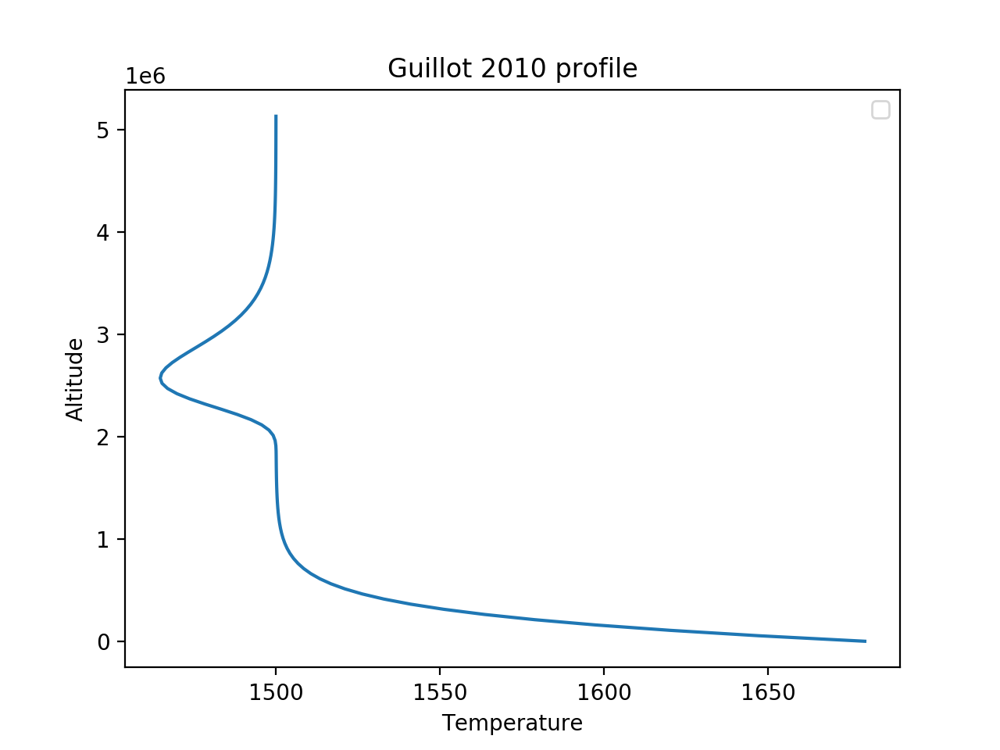
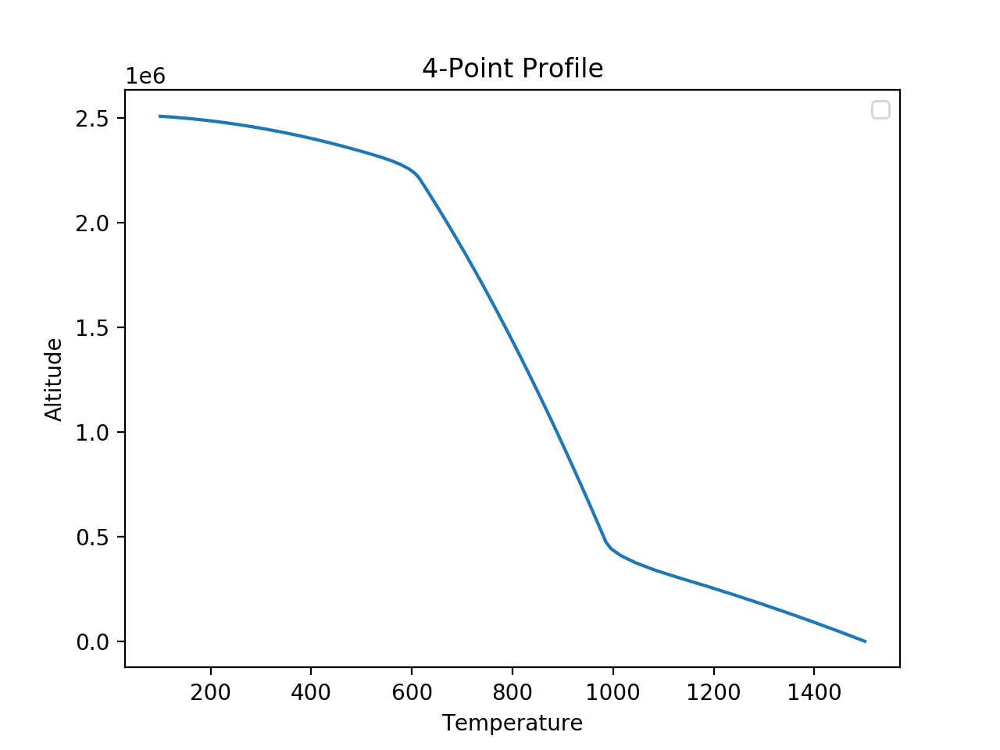
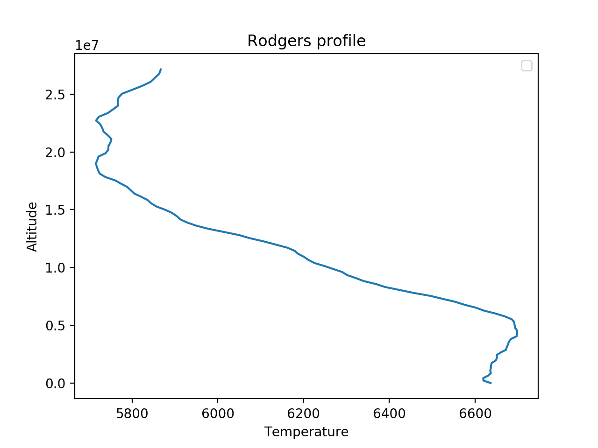

.. _temperature:

=================
``[Temperature]``
=================

This header is used to define temperature profiles for the atmosphere.
The type of temperature profile is defined by the ``profile_type`` variable

The available ``profile_type`` are:
    - ``isothermal``
        - Isothermal temperature profile
        - Class: :class:`~taurex.data.profiles.temperature.isothermal.Isothermal`

    - ``guillot2010``
        - TP profile from Guillot 2010, A&A, 520, A27
        - Class: :class:`~taurex.data.profiles.temperature.guillot.Guillot2010`
    
    - ``npoint``
        - N-point temperature profile
        - Class: :class:`~taurex.data.profiles.temperature.npoint.NPoint`
    
    - ``rodgers``
        - Layer-by-layer temperature - pressure profile
        - Class: :class:`~taurex.data.profiles.temperature.rodgers.Rodgers2000`
    

Isothermal Profile
------------------

Constant temperature throughout atmosphere

.. figure::  _static/isothermal.png
   :align:   left
   :width: 80%

Variables are:

    - ``iso_temp``
        - float
        - Temperature in Kelvin
        - Default: ``iso_temp = 1500.0``

Guillot 2010 Profile
--------------------

TP profile from Guillot 2010, A&A, 520, A27 (equation 49)
Using modified 2stream approx. from Line et al. 2012, ApJ, 749,93 (equation 19)

Variables are:
    - ``T_irr``
        - float
        - Planet equilibrium temperature
    - ``kappa_ir``
        - float
        - mean infra-red opacity
    - ``kappa_v1``
        - float
        - mean optical opacity one
    - ``kappa_v2``
        - float
        - mean optical opacity two
    - ``alpha``
        - float
        - ratio between kappa_v1 and kappa_v2 downwards radiation stream

N-Point Profile
---------------

Temperature defined at various heights in the atmosphere. Smoothing is then applied.

Variables are:

    - ``T_surface``
        - float
        - Temperature at the planets surface in Kelvin

    - ``T_top``
        - Temperature at the top of the atmosphere in Kelvin

    - ``temperature_points`` 
        - list of floats
        - temperature points between ``T_top`` and ``T_surface``

    - ``pressure_points``
        - list of floats
        - Pressure points that the each temperature in ``temperature_points`` lie on

    - ``smoothing_window``
        - int
        - Smoothing width in atmospherice layers

Rodgers 2000 Profile
--------------------

Layer-by-layer temperature - pressure profile retrieval using dampening factor
Introduced in Rodgers (2000): Inverse Methods for Atmospheric Sounding (equation 3.26)

